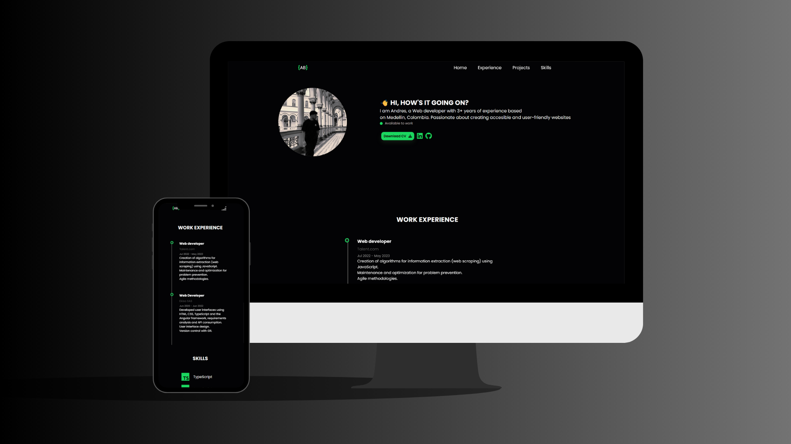

# 🌐 Portfolio Template

A modern and responsive personal portfolio template built with **HTML**, **CSS**, and **JavaScript**. Designed for developers who want to showcase their experience, technical skills, and links in one clean and attractive interface.

---


## 📸 Preview



---

## ✨ Features

- Responsive design for all devices
- Smooth scrolling navigation
- Sections for:
  - Personal introduction
  - Work experience
  - Technical skills
- Integrated CV download
- Social and GitHub links
- Subtle animations

---

## 📁 Project Structure

```
portfolio-template/
│
├── index.html        # Main structure
├── style.css         # Custom styles
├── main.js           # Navigation logic
├── img/
│   └── profile-transparent.jpg  # Profile image
└── files/
    └── Andres-Bolaños-cv.pdf    # CV file
```

---

## 🚀 How to Use

1. Clone this repository:
   ```bash
   git clone https://github.com/andresfelipe07b/portfolio-template.git
   ```
2. Open `index.html` in your browser.
3. Customize your data:
   - Name, skills, experience, links, etc.
4. (Optional) Replace the profile image.

---

## 🛠️ Technologies

- HTML5
- CSS3 (animations and responsive design)
- JavaScript
- [Font Awesome](https://fontawesome.com/)
- [Devicon](https://devicon.dev/)

---

## 📄 License

Licensed under the [MIT License](LICENSE).

---

Developed by **Andrés Bolaños** – Available to work.
