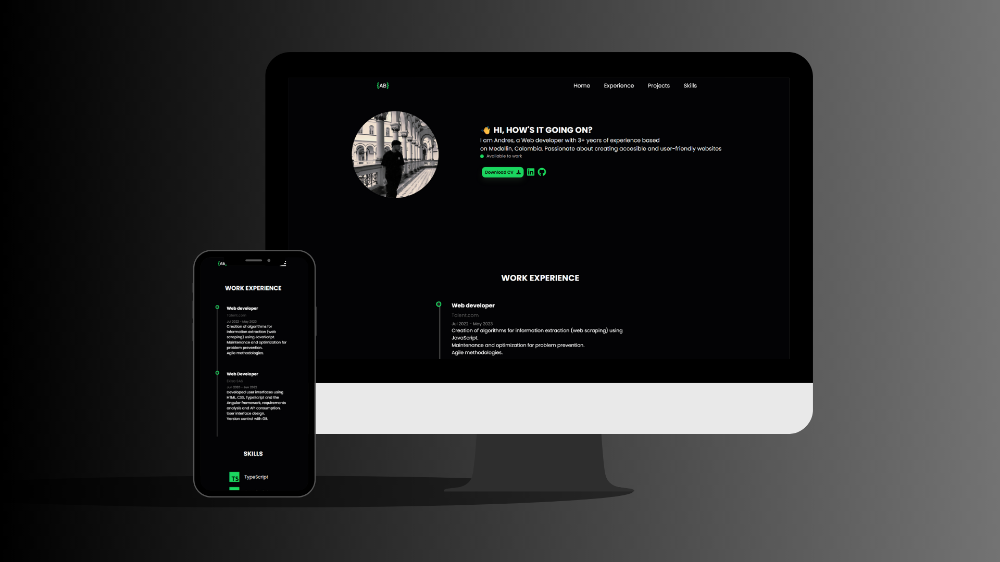

# 🌐 Plantilla de Portafolio

Una plantilla de portafolio personal moderna y responsiva desarrollada con **HTML**, **CSS** y **JavaScript**. Diseñada para desarrolladores que desean mostrar su experiencia, habilidades técnicas y enlaces relevantes en una interfaz limpia y atractiva.

---

## 📸 Preview



---

## ✨ Características

- Diseño adaptable a dispositivos móviles
- Navegación fluida con desplazamiento suave
- Secciones para:
  - Introducción personal
  - Experiencia laboral
  - Habilidades técnicas
- Descarga de CV 
- Enlaces sociales y a GitHub
- Animaciones sutiles

---

## 📁 Estructura del proyecto

```
portfolio-template/
│
├── index.html        # Estructura principal
├── style.css         # Estilos personalizados
├── main.js           # Lógica de navegación
├── img/
│   └── profile-transparent.jpg  # Imagen de perfil
└── files/
    └── -cv.pdf    # Archivo CV
```

---

## 🚀 Cómo usar

1. Clona este repositorio:
   ```bash
   git clone https://github.com/andresfelipe07b/portfolio-template.git
   ```
2. Abre el archivo `index.html` en tu navegador.
3. Personaliza la información:
   - Nombre, habilidades, experiencia, enlaces, etc.
4. (Opcional) Reemplaza la imagen de perfil.

---

## 🛠️ Tecnologías utilizadas

- HTML5
- CSS3 (con animaciones y diseño responsive)
- JavaScript
- [Font Awesome](https://fontawesome.com/)
- [Devicon](https://devicon.dev/)

---


## 📄 Licencia

Este proyecto está licenciado bajo la [Licencia MIT](LICENSE).

---

Desarrollado por **Andrés Bolaños** – Disponible para trabajar.
